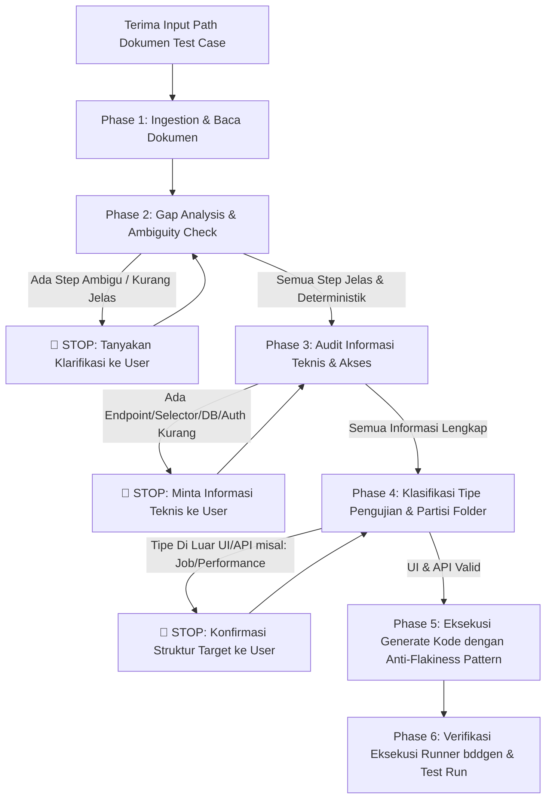

# Skill: Generate Automation (Senior QA SOP - Enterprise Edition)

Panduan ini berisi Standard Operating Procedure (SOP) wajib bagi agen ketika menerima instruksi untuk men-generate script/skenario test automation dari dokumen acuan (*Master Test Case Suite*).

---

## 🛑 Golden Rule: Zero Assumption Guardrail
> **JANGAN PERNAH membuat asumsi sendiri.** Jika ada step yang ambigu, selector yang belum pasti, endpoint API yang belum lengkap, atau kredensial/koneksi yang belum terdefinisi, **WAJIB BERTANYA DAN MEMINTA KONFIRMASI KEPADA USER** sebelum membuat atau mengubah kode automation.

---

## 🛡️ 4 Pilar Anti-Flakiness Engineering Hygiene (Wajib Dipatuhi)

Berdasarkan pengalaman nyata dalam eksekusi automation pada aplikasi Single Page Application (SPA) dan lingkungan live, aturan-aturan ini **wajib diintegrasikan langsung saat kode pertama kali dibuat**:

### 1. Isolasi Konfigurasi Network & Headers (Config Hygiene)
* **Larangan:** Jangan pernah memasang header API (seperti `Content-Type: application/json` atau `Accept: application/json`) pada level global `use:` di `playwright.config.ts`.
* **Dampak:** Memaksa header JSON pada request halaman web akan merusak form submission HTML (`application/x-www-form-urlencoded`) dan menyebabkan penolakan CSRF token oleh backend server.
* **Aturan:** Konfigurasi header API hanya boleh diset pada layer `BaseApiClient` atau scope project `api`.

### 2. Kesiapan Form & Token SPA (Hydration Readiness Guard)
* **Masalah:** Otomasi mengetik dalam hitungan milidetik. Pada aplikasi SPA (React/Vue/Angular), field input username mungkin sudah terlihat di DOM, namun hidden token (seperti CSRF `_token`) atau listener JavaScript background masih dalam proses *hydration*.
* **Aturan:** Sebelum mengisi atau men-submit form yang memiliki proteksi token dinamis, terapkan proteksi kesiapan:
  ```typescript
  // Tunggu token terpasang di DOM dan memiliki value yang valid
  await this.page.waitForFunction(() => {
    const el = document.querySelector('input[name="_token"]') as HTMLInputElement;
    return el && el.value && el.value.length > 0;
  }, { timeout: 10000 });
  ```

### 3. Disiplin Selector Tunggal (Strict Mode Discipline)
* **Masalah:** Playwright menerapkan *Strict Mode* secara default. Jika selector merespons lebih dari 1 elemen di DOM, asersi seperti `expect(locator).toBeVisible()` akan gagal dengan error `strict mode violation`.
* **Larangan:** Jangan menggunakan selector gabungan berkoma (misal: `page.locator('.class-a, .class-b')`) tanpa scoping yang unik.
* **Aturan:** Selalu gunakan locator yang bersifat strictly unik (1 elemen) atau gunakan `.first()` / `.filter()` jika ada kemungkinan elemen ganda di DOM.

### 4. Strategi Navigasi Resilien (Smart Navigation)
* **Larangan:** Jangan mengandalkan `page.waitForLoadState('networkidle')` sebagai metode utama perpindahan halaman pada web publik/live. Background font loading, analytics, dan third-party tracking scripts sering kali mencegah event networkidle tercapai dan memicu timeout 30s.
* **Aturan:** Gunakan `page.goto(path, { waitUntil: 'domcontentloaded' })` yang dipadukan dengan *Smart Auto-Waiting* pada locator elemen kunci tujuan (misal: menunggu judul dashboard terlihat).

---

## 🔄 Alur Kerja Siklus Hidup Generate Automation



---

## 📌 Rincian Fase Eksekusi

### 1. Ingestion & Pembacaan Dokumen Acuan
* Baca file master test case dari path spesifik (`master-testcases/` atau path input user).
* Ekstraksi seluruh metadata: ID, Prioritas/Tagging, Tipe Pengujian, Precondition, Action Steps, dan Assertions.

### 2. Gap Analysis & Evaluasi Kejelasan Step
* Periksa apakah setiap step manual dapat dieksekusi secara otomatis dan deterministik.
* Jika ada step yang high-level (tanpa rincian form, tombol, atau navigasi), **WAJIB TANYA KE USER**.

### 3. Audit Informasi Teknis, Akses, & Lingkungan
* **URL & Credentials:** Pastikan `BASE_URL` atau `BASE_URL_SAMPLE` terdefinisi di `.env`.
* **API Testing:** Endpoint path, HTTP method, payload structure, dan response schema.
* **UI Testing:** Alur interaksi dan penanda elemen/selector.
* **DB Verification:** Jika ada asersi DB namun environment tidak memiliki akses direct SQL (seperti public demo instance), **konfirmasi ke user apakah asersi DB dialihkan/diabaikan**.

### 4. Partisi Folder Output yang Ketat
Output **WAJIB** dipisahkan secara tegas:
```text
features/
├── api/                           # Khusus skenario API testing (@api)
│   └── *.feature
├── web/                           # Khusus skenario UI/Web testing (@web / @ui)
│   └── *.feature
└── (tipe lain)                    # WAJIB konfirmasi ke user sebelum dibuat!

src/
├── api/                           # API Client layer
├── pages/                         # Page Object Model (POM) layer
└── steps/
    ├── api/                       # Step definitions khusus API
    └── web/                       # Step definitions khusus Web/UI
```

### 5. Eksekusi Generate Kode (Mengikuti 4 Pilar Hygiene)
1. Tulis skenario BDD Gherkin (`.feature`) pada folder yang sesuai.
2. Buat Page Objects (`src/pages/`) dengan selector strictly unik dan method yang menerapkan *hydration readiness guard*.
3. Buat Step Definitions (`src/steps/`) dengan binding parameter dinamis dan smart assertion.
4. Pastikan `playwright.config.ts` menggunakan jumlah worker yang stabil terhadap beban server target (misal: 2 workers untuk public live server).

### 6. Verifikasi Eksekusi Runner
1. Jalankan `npx bddgen` untuk memastikan seluruh Gherkin step terhubung ke step definitions tanpa missing step.
2. Jalankan uji coba eksekusi (`npx playwright test`) untuk memastikan suite berjalan stabil tanpa syntax error atau flakiness.
