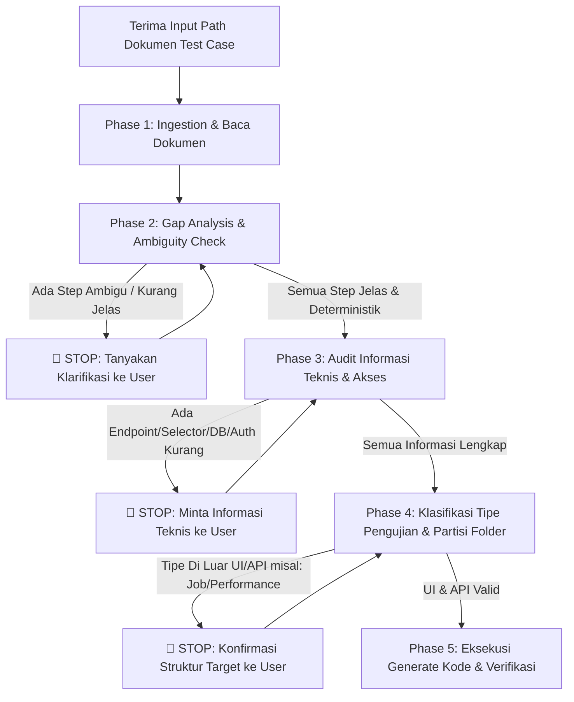

# Skill: Generate Automation (Senior QA SOP)

Panduan ini berisi Standard Operating Procedure (SOP) wajib bagi agen ketika menerima instruksi untuk men-generate script/skenario test automation dari dokumen acuan (*Master Test Case Suite*).

---

## 🛑 Golden Rule: Zero Assumption Guardrail
> **JANGAN PERNAH membuat asumsi sendiri.** Jika ada step yang ambigu, selector yang belum pasti, endpoint API yang belum lengkap, atau kredensial/koneksi yang belum terdefinisi, **WAJIB BERTANYA DAN MEMINTA KONFIRMASI KEPADA USER** sebelum membuat atau mengubah kode automation.

---

## 🔄 Alur Kerja Siklus Hidup Generate Automation



---

## 📌 Rincian 5 Fase SOP

### 1. Ingestion & Pembacaan Dokumen Acuan
* Baca file master test case dari path spesifik yang diberikan user (atau cari di folder acuan jika telah ditentukan).
* Lakukan ekstraksi seluruh metadata: ID Test Case, Prioritas/Tagging, Tipe Pengujian, Precondition, Action Steps, dan Expected Results / Assertions.

### 2. Gap Analysis & Evaluasi Kejelasan Step
Periksa apakah seluruh test step dapat dieksekusi secara otomatis dan deterministik:
* **Larangan:** Jangan men-generate kode dari step yang bersifat *high-level* tanpa kejelasan teknis (misal: *"Lakukan checkout barang promo"* tanpa rincian step pilih item, input voucher, dan klik submit).
* **Aksi:** Jika ditemukan ketidakjelasan pada step, buat daftar pertanyaan spesifik kepada user dan tunggu jawaban sebelum melanjutkan.

### 3. Audit Informasi Teknis, Akses, & Koneksi
Audit ketersediaan informasi pendukung berikut:
* **API Testing:** Endpoint URL/path, HTTP method, payload request JSON/Form, headers, dan struktur response schema.
* **UI/Web Testing:** URL navigasi, alur interaksi (apakah single modal, multi-step wizard, dll.), dan penanda elemen/selector yang disepakati.
* **Database & Credential:** Kebutuhan query verifikasi tabel, skema kolom, atau kredensial akun per role (Admin, Agent, Supervisor).
* **Aksi:** Jika ada informasi yang belum ada di dokumen atau file `.env`, tanyakan langsung kepada user.

### 4. Partisi Folder Output yang Ketat
Output yang dihasilkan **WAJIB** dipisahkan secara tegas berdasarkan jenis/tipe pengujian:

```text
features/
├── api/                           # Khusus skenario API testing (@api)
│   └── *.feature
├── web/                           # Khusus skenario UI/Web testing (@web / @ui)
│   └── *.feature
└── (tipe lain)                    # WAJIB konfirmasi ke user sebelum dibuat!

src/
├── api/                           # API Client layer
├── pages/                         # Page Object Model (POM) layer
└── steps/
    ├── api/                       # Step definitions khusus API
    └── web/                       # Step definitions khusus Web/UI
```
* **Perhatian:** Jika terdapat pengujian di luar Web UI dan API (misalnya: *Background Job / Worker, Network Chaos, Mobile, Load Test*), **JANGAN berasumsi membuat folder sendiri**. Konfirmasikan kepada user struktur folder dan runner yang diinginkan.

### 5. Eksekusi Generate & Verifikasi
Setelah seluruh konfirmasi selesai dan informasi lengkap:
1. Buat file skenario BDD Gherkin (`.feature`) pada folder yang sesuai.
2. Buat / update Page Objects (`src/pages/`) atau API Clients (`src/api/`).
3. Buat Step Definitions (`src/steps/`) dengan binding parameter dinamis.
4. Jalankan `npm run bdd:gen` dan `npm test` untuk memastikan skenario tervalidasi dan tidak ada syntax/type error.
