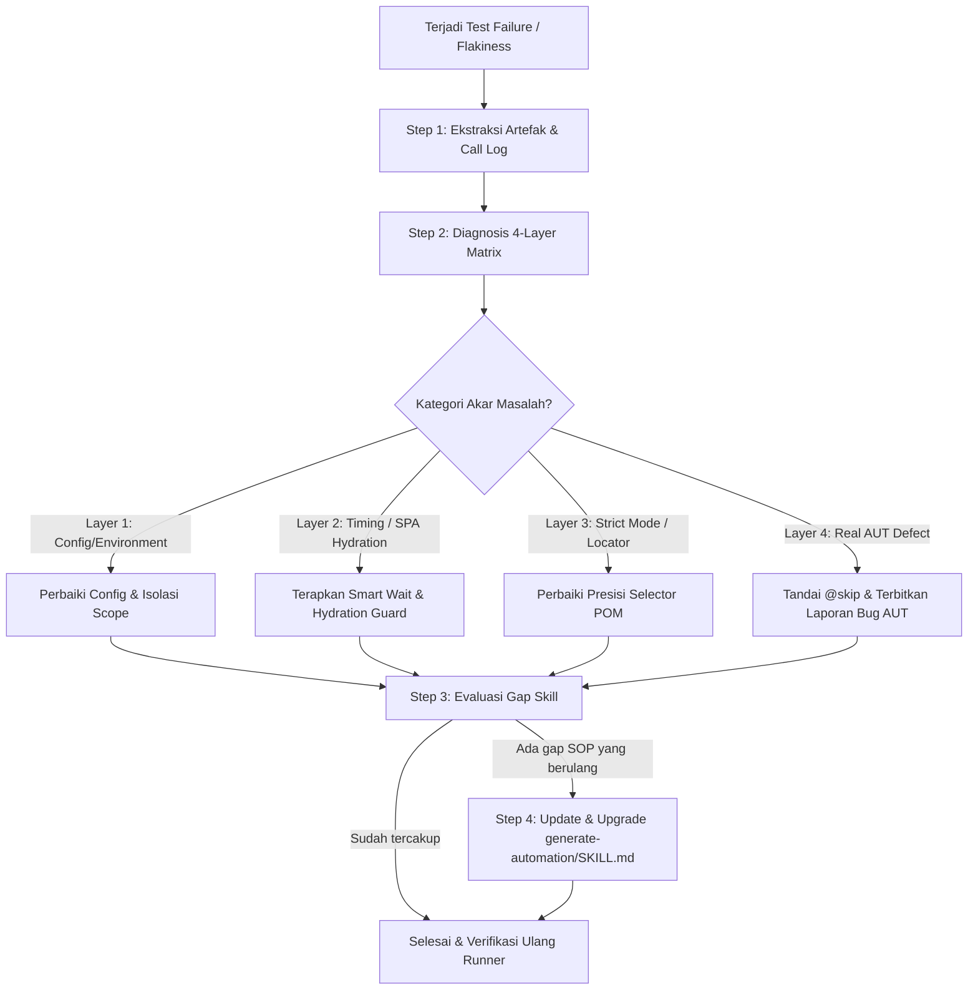

# Skill: Review Automation (Senior QA Self-Audit & Continuous Improvement)

Skill ini berfungsi sebagai **mesin evaluasi, audit independen, dan continuous improvement** terhadap proses test automation dan skill `generate-automation`. 

Gunakan skill ini ketika:
1. Terjadi kegagalan (*failed tests*) atau ketidakstabilan (*flaky tests*) pada test suite.
2. Ditemukan anomali atau diskrepansi antara dokumen acuan (*Master Test Case*) dengan perilaku aplikasi nyata (*Application Under Test / AUT*).
3. Perlu dilakukan audit retrospektif untuk memperbarui aturan/SOP pada `generate-automation`.

---

## 🔄 Alur Kerja Root Cause Analysis (RCA) 4-Layer

---

## 🔍 4-Layer Diagnostic Matrix

Ketika menganalisis error otomasi, lakukan evaluasi sistematis menggunakan matriks ini:

### Layer 1: Config & Environment Leak
* **Gejala:** Error 400 Bad Request, CSRF validation failed, CORS error, atau 401 Unauthorized secara massal.
* **Pertanyaan Audit:**
  * Apakah ada `extraHTTPHeaders` JSON yang bocor ke request HTML form web?
  * Apakah URL target di `.env` sudah sesuai dengan instance yang aktif?
  * Apakah jumlah worker parallel terlalu banyak sehingga memicu rate-limiting pada server public demo?

### Layer 2: Timing, Race Condition, & SPA Hydration
* **Gejala:** `TimeoutError: locator.waitFor: Timeout 15000ms exceeded`, form ter-submit dengan data kosong atau token tidak valid.
* **Pertanyaan Audit:**
  * Apakah elemen input diisi terlalu cepat sebelum JavaScript framework (Vue/React) selesai me-render data/token background?
  * Apakah navigasi tertahan karena menggunakan `networkidle` pada server yang memiliki active polling?
  * **Solusi:** Ganti ke `domcontentloaded` dan pasang `waitForFunction` untuk memvalidasi kesiapan state.

### Layer 3: Playwright Strict Mode & Locator Precision
* **Gejala:** `Error: strict mode violation: locator(...) resolved to X elements`.
* **Pertanyaan Audit:**
  * Apakah selector di Page Object Model menggunakan operator koma (`,`) tanpa scoping unik?
  * Apakah selector teks menghasilkan match parsial pada beberapa elemen sekaligus?
  * **Solusi:** Buat locator spesifik berakar pada container unik atau gunakan `.first()` secara terarah.

### Layer 4: AUT Defect vs Automation Script Flakiness
* **Pembedaan Krusial:**
  * **Script Flakiness:** Script gagal karena selector salah, timing kecepatan, atau config error (Tanggung jawab QA Automation untuk memperbaiki script).
  * **AUT Defect:** Script berjalan sempurna sesuai step PRD/Test Case, namun aplikasi nyata memberikan respon berbeda (contoh: PRD meminta *partial search* `"Adm"`, tapi aplikasi nyata menerapkan *exact match* sehingga menghasilkan `No Records Found`).
  * **Aksi untuk AUT Defect:** **JANGAN paksa ubah script menjadi salah.** Tandai skenario dengan `@skip`, dokumentasikan bukti screenshot/video, dan laporkan sebagai *Application Defect*.

---

## 🛠️ Protokol Self-Upgrade `generate-automation`

Jika hasil audit menemukan bahwa akar masalah terjadi karena **kelemahan pada SOP generator** (bukan bug aplikasi), lakukan tindakan berikut:

1. **Rangkum Temuan:** Tuliskan ringkasan teknis mengenai pola error yang terjadi.
2. **Formulasikan Aturan Pencegahan (Preventive Rule):** Buat klausul baru yang melarang pola error tersebut.
3. **Update `generate-automation/SKILL.md`:** Masukkan aturan baru ke dalam sub-bab *Engineering Hygiene*.
4. **Verifikasi:** Jalankan ulang seluruh test suite untuk membuktikan bahwa perbaikan berhasil menghilangkan error secara permanen.
